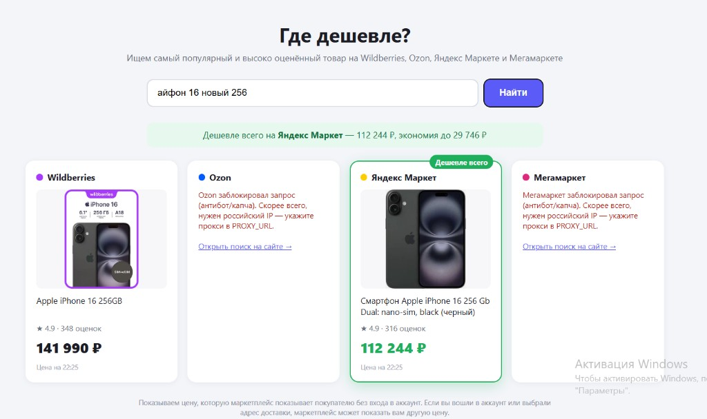

# Где дешевле?

Сайт для сравнения цен на маркетплейсах. Вводите запрос (например, «iPhone 16», «корм для кошек», «стиральная машина») — сайт ищет товар на **Wildberries**, **Ozon**, **Яндекс Маркете** и **Мегамаркете**, показывает по одному предложению с каждого и подсвечивает самое дешёвое.




## Как выбирается предложение

С каждого маркетплейса берётся одно предложение:

1. **Поиск по ключевым словам.** Каждое слово запроса должно встречаться в названии или описании товара. Учитываются окончания («смартфоны» ↔ «смартфон») и популярные русские написания брендов («айфон» → iphone, «самсунг» → samsung и т.п.). Аксессуары вроде «Чехол для iPhone 16» отсеиваются, если в запросе нет слова «чехол».
2. **Только популярные и высоко оценённые.** Выдача маркетплейса берётся в порядке популярности (на Ozon — по рейтингу). Из первых 40 подходящих товаров выбирается лучший по рейтингу с учётом числа оценок: 5.0 при двух оценках не обгонит 4.9 при трёх тысячах.
3. **Всегда есть результат.** Если ни один товар не содержит всех слов запроса, берутся товары с наибольшим совпадением, а в крайнем случае — верх выдачи самого маркетплейса.

Карточки появляются по мере готовности.

## Цены

Показывается та цена, которую маркетплейс показывает покупателю **без входа в аккаунт**:

- Если вы вошли в аккаунт маркетплейса, он может показать вам другую цену (персональные скидки). Сравнивать удобнее в режиме инкогнито.


## Установка и запуск

```powershell
python -m venv .venv
.\.venv\Scripts\pip install -r requirements.txt
.\.venv\Scripts\python -m playwright install chromium
.\.venv\Scripts\python run.py
```

На Linux/macOS вместо `.\.venv\Scripts\` используйте `.venv/bin/`.

Сайт откроется на http://127.0.0.1:8000. Если порт занят, задайте другой:


## Структура проекта

```
run.py                    запуск сервера
app/
  main.py                 FastAPI: API и раздача страницы
  config.py               настройки из переменных окружения
  browser.py              общий браузер, прокси, распознавание блокировок
  matching.py             поиск по ключевым словам и выбор лучшего товара
  models.py               модели данных
  parsers/
    wildberries.py
    ozon.py
    yandex_market.py
    megamarket.py
  static/                 страница: index.html, app.js, style.css
```

